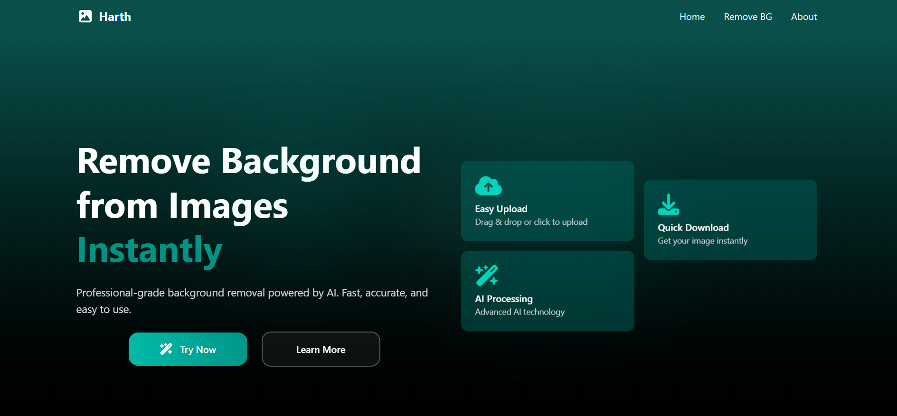

# Harth - AI Background Removal

<div align="center">
  
  
  **Professional AI-powered background removal made simple, fast, and accessible to everyone.**
  
  [](https://reactjs.org/)
  [](https://vitejs.dev/)
  [](https://tailwindcss.com/)
  [](#license)
</div>

## 🚀 Live Demo

**Experience Harth in action:** [harth0.web.app](https://harth0.web.app)

*Note: This is a frontend demonstration. The actual AI processing is handled by our backend services.*

## ✨ Features

- 🎨 **Beautiful UI/UX** - Modern, responsive design with smooth animations
- ⚡ **Lightning Fast** - Optimized for speed and performance
- 📱 **Mobile First** - Fully responsive across all devices
- 🎭 **Interactive Demo** - Experience the full user journey
- 🌙 **Dark Theme** - Elegant dark mode with teal accents
- 🔄 **Real-time Processing** - Simulated AI processing with progress indicators
- 📁 **Multiple Upload Options** - File upload, camera capture, photo library
- 🎯 **Professional Results** - High-quality background removal simulation

## 🛠️ Tech Stack

- **Frontend:** React 18, Vite, Tailwind CSS
- **Icons:** Font Awesome 6.5.1
- **Animations:** AOS (Animate On Scroll), Custom CSS animations
- **Routing:** React Router DOM
- **Build Tool:** Vite with Tailwind CSS v4

## 📸 Screenshots

<div align="center">
  
  <p><em>Beautiful hero section showcasing Harth's modern design</em></p>
  
  <div style="display: flex; gap: 20px; justify-content: center; margin-top: 20px;">
    <div style="text-align: center;">
      
      <p><em>Before</em></p>
    </div>
    <div style="text-align: center;">
      
      <p><em>After</em></p>
    </div>
  </div>
  <p style="text-align: center; margin-top: 10px;"><em>Professional background removal demonstration</em></p>
</div>

## 🚀 How to Use

### Live Application
**Simply visit [harth0.web.app](https://harth0.web.app) to use Harth directly in your browser!**

### For Developers
*This section is for educational purposes only. Please respect the license terms.*

**Note:** This code is for viewing and learning purposes only. See [LICENSE](LICENSE) for usage terms.

## 📁 Project Structure

```
harth/
├── src/
│   ├── components/
│   │   ├── home/           # Home page sections
│   │   └── layout/         # Navbar, Footer, Loading
│   ├── pages/
│   │   ├── home/           # Home page
│   │   ├── removebg/       # Background removal page
│   │   └── about/          # About page
│   ├── assets/             # Images and static files
│   └── main.jsx           # App entry point
├── public/                # Public assets
├── package.json
└── README.md
```

## 🎨 Design Features

- **Modern UI/UX** - Clean, professional interface
- **Smooth Animations** - AOS scroll animations and custom CSS effects
- **Responsive Design** - Mobile-first approach with Tailwind CSS
- **Loading Screen** - Custom animated loading with rolling "H" effect
- **Interactive Elements** - Hover effects, transitions, and micro-interactions


## 📱 Pages

- **Home** - Landing page with features and showcase
- **Remove BG** - Interactive background removal demo
- **About** - Information about Harth and the developer

## 🤝 Contributing

This project is for demonstration purposes. If you'd like to contribute or have suggestions:

1. Fork the repository
2. Create a feature branch
3. Make your changes
4. Submit a pull request

## 📄 License

This project is licensed under a **Custom License**. See [LICENSE](LICENSE) file for details.

**Key Points:**
- ✅ **Viewing allowed** - You can view and study the code
- ✅ **Free use allowed** - You can use the application for free
- ❌ **Copying prohibited** - You cannot copy or redistribute the code
- ❌ **Commercial use prohibited** - You cannot use this code for commercial purposes

## 👨‍💻 Developer

**Mr Heritage (Olayoriju Inioluwa)**
- 🌐 Portfolio: [mr-heritage.web.app](https://mr-heritage.web.app)
- 💼 LinkedIn: [Olayoriju Inioluwa](https://www.linkedin.com/in/olayoriju-inioluwa-116399383/)
- 🐙 GitHub: [@Inioluwa-dev](https://github.com/Inioluwa-dev/)
- 🐦 Twitter: [@Inioluwa_dev](https://x.com/Inioluwa_dev)
- 📸 Instagram: [@inioluwa_dev](https://www.instagram.com/inioluwa_dev/)

## 🙏 Acknowledgments

- Font Awesome for the beautiful icons
- Tailwind CSS for the utility-first styling
- React community for the amazing ecosystem
- AOS library for smooth scroll animations

## 📞 Contact

For business inquiries or questions about this project:
- Email: [misterhge@gmail.com]
- Website: [mr-heritage.web.app](https://mr-heritage.web.app)

---

<div align="center">
  <p>Made by <strong>Mr Heritage</strong></p>
  <p>© 2025 Comibyte Team. All rights reserved.</p>
</div>